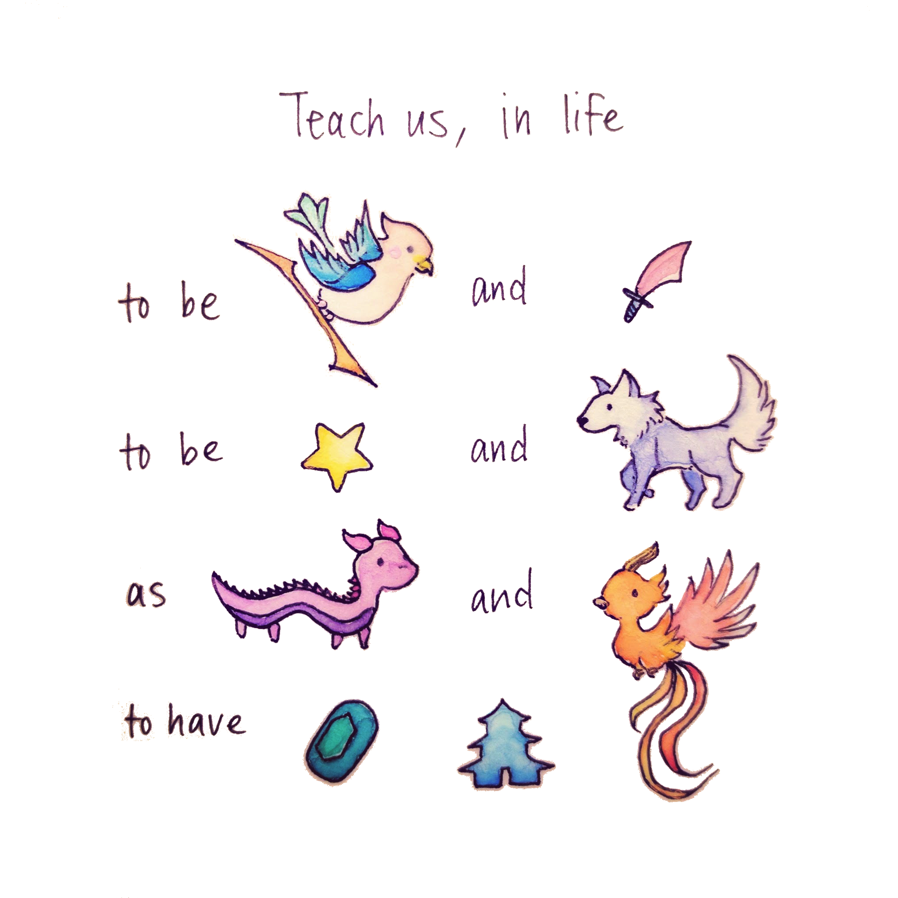

# Teach us

This is a puzzle [my girlfriend](https://github.com/dragonaire) and I made as a wedding card for our amazing friends Joy and Alex when they got married.

We sent them two simultaneous emails, one to Joy containing [`an_artful_ode_to_joy.html`](https://teach-us.netlify.com/an_artful_ode_to_joy.html)
and a second to Alex containing [`a_lexicon_of_tricks.html`](https://teach-us.netlify.com/a_lexicon_of_tricks.html).

We've also made [a more self-contained version](https://teach-us.netlify.com/teach_us.html)

For solutions, scroll below.

[Solution](https://teach-us.netlify.com/solution.html)

